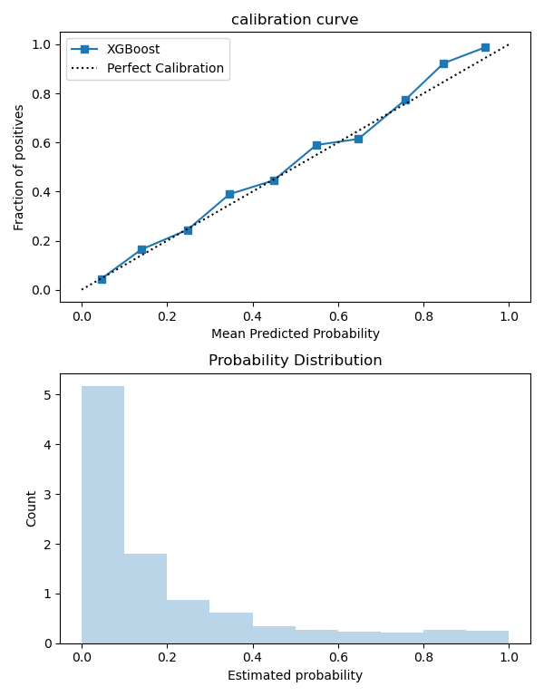
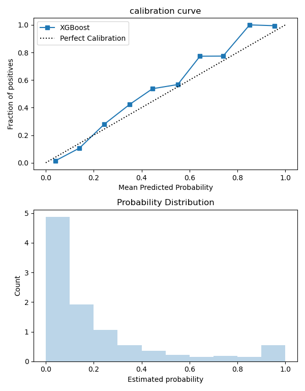

# XGBoost-and-Model-Calibration

This repository aims to predict the customer churn using XGBoost and then apply a model calibration to obtain a more realistic probability. The dataset can be obtained from [kaggle](https://www.kaggle.com/datasets/shubhammeshram579/bank-customer-churn-prediction).

## XGBoost model implementation

According to the official [documentation](https://xgboost.readthedocs.io/en/stable/), XGBoost is an optimized distributed gradient boosting library designed to be highly efficient, flexible and portable. It implements machine learning algorithms under the Gradient Boosting framework.

### Exploratory Data Analysis

Before starting the model implementatio, the data has been explored in order to find anomalies as well as understanding it better.
The data exploration can be found on the `notebooks/eda.ipynb` file. Note that more analyses could have been carried out.

The dataset includes the following attributes:

1. Customer ID: A unique identifier for each customer
2. Surname: The customer's surname or last name
3. Credit Score: A numerical value representing the customer's credit score
4. Geography: The country where the customer resides (France, Spain or Germany)
5. Gender: The customer's gender (Male or Female)
6. Age: The customer's age.
7. Tenure: The number of years the customer has been with the bank
8. Balance: The customer's account balance
9. NumOfProducts: The number of bank products the customer uses (e.g., savings account, credit card)
10. HasCrCard: Whether the customer has a credit card (1 = yes, 0 = no)
11. IsActiveMember: Whether the customer is an active member (1 = yes, 0 = no)
12. EstimatedSalary: The estimated salary of the customer
13. Exited: Whether the customer has churned (1 = yes, 0 = no)

### Model implementation

Once the data has been explored, the next step consists of implementing the XGBoost model classifier. But before that, the data needs to be cleaned and split into train and test.

#### Data Cleaning
The data has been cleaned and transformed as follows:

1. Remove duplicates
2. Drop nulls since there were only a few instances (otherwise, we would need some kind of imputation)
3. Drop columns (`RowNumber`, `CustomerId`, `Surname`)

Once the data is cleaned, we can use the `train_test_split()` function from the scikit-learn package to split the data between training and testing. This part can be found on the `steps/clean_data.py` file.

#### Model Training

The `XGBClassifier` model can be trained using the scikit-learn API using the `fit()` function. However, we still need to define the hyperparameters. All the parameters that can be configured for the `XGBoost` are listed in the [documentation](https://xgboost.readthedocs.io/en/stable/parameter.html), but for the purpose of this project we are using a `GridSearch` to optimise only the following parameters:
* subsample: Subsample ratio of the training instances
* min_split_loss: Minimum loss reduction required to make a further partition on a leaf node of the tree
* n_estimators: Number of trees
* learning_rate: Step size shrinkage used in update to prevents overfitting
* max_depth: Maximum depth of a tree

This part can be found on the `steps/model_train.py` file.

#### Model Evaluation

Finally, we can use the model to make a prediction on the test data. The results are compared with actual values and we can evaluate the model using different metrics. In this case, we review the recall, accuracy and f1-score.

This part can be found on the `steps/evaluation.py` file.

## Model Calibration

According to the Tidyverse [blog](https://www.tidyverse.org/blog/2022/11/model-calibration/#model-calibration), the goal of model calibration is to ensure that the estimated class probabilities are consistent with what would naturally occur.

In [this post](https://www.linkedin.com/feed/update/urn:li:activity:7199727271308345344/) we can understand better the importance of model calibration with a simple example.

In order to understand whether our model is calibrated or not, we can use two approaches:
* Calibration plot
* Brier score

_Check [this](https://www.analyticsvidhya.com/blog/2022/10/calibration-of-machine-learning-models/) blog for more information_.

For the purpose of this project, we are using only the calibration plot, which can be obtained using the scikit-learn package (`calibration_curve()`). If we take a look at the calibration plot for the non-calibrated model:

We can see that the plot follows quite well the dashed line. Nevertheless, in order to calibrate the model, there are two popular methods:

* Platt Scaling
* Isotonic Regression 

Using the `CalibratedClassifierCV()` from  scikit-learn, we can choose between both methods. In this case, it has been used `method="isotonic"`, and the calibration plot for the new calibrated model looks like this:

Additionally, if we look at the overall accuracy, it improves from 86% to 88% when using the calibrated model (note that depending on the use case we may need to look at other metrics).

All the computations can be found on the `notebooks/model_calibration.ipynb` file or  the `calibration/calibratioo.py`.